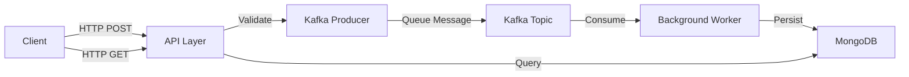

# 🚀 Scalable Event-Driven Logging System

<div align="center">

**Eyego Backend Internship Task**

\*A high-performance Microservices-ready logging system built with **Node.js**, **TypeScript**, **Kafka**, and **MongoDB\***

[](https://www.typescriptlang.org/)
[](https://nodejs.org/)
[](https://www.docker.com/)
[](https://kafka.apache.org/)
[](https://www.mongodb.com/)

</div>

---

## 📖 Table of Contents

- [🏛 Architecture & Design](#-architecture--design)
  - [Data Flow](#data-flow)
  - [Layer Structure](#layer-structure)
- [🛠 Tech Stack](#-tech-stack)
- [✨ Features](#-features)
- [⚙️ Prerequisites](#️-prerequisites)
- [🚀 Installation & Setup](#-installation--setup)
- [📡 API Documentation](#-api-documentation)
- [📂 Project Structure](#-project-structure)

---

## 🏛 Architecture & Design

This project follows **Clean Architecture** and **Domain-Driven Design (DDD)** principles to ensure **scalability**, **maintainability**, and **separation of concerns**.

### Data Flow



#### Flow Steps

| Step  | Component                  | Description                                                                          |
| ----- | -------------------------- | ------------------------------------------------------------------------------------ |
| **1** | 🌐 **Ingestion (API)**     | Client sends log via HTTP. API validates and pushes to Kafka Topic (non-blocking)    |
| **2** | 📨 **Queue (Kafka)**       | Acts as a buffer to handle high-throughput traffic without overwhelming the database |
| **3** | ⚙️ **Processing (Worker)** | Background consumer listens to topic, reconstructs Domain Entity, and persists it    |
| **4** | 💾 **Storage (MongoDB)**   | Stores logs for retrieval and analytics                                              |

### Layer Structure

```
┌─────────────────────────────────────────────────────────────┐
│                    Interface Layer 🔵                        │
│            (Controllers, Consumers, Routes)                  │
├─────────────────────────────────────────────────────────────┤
│                   Application Layer 🟡                       │
│              (Use Cases, DTOs, Orchestration)               │
├─────────────────────────────────────────────────────────────┤
│                     Domain Layer 🟢                          │
│          (Entities, Interfaces, Business Logic)             │
├─────────────────────────────────────────────────────────────┤
│                 Infrastructure Layer 🔴                      │
│       (Kafka, MongoDB, External Dependencies)               │
└─────────────────────────────────────────────────────────────┘
```

#### Layer Responsibilities

| Layer                 | Purpose                                         | Examples                               |
| --------------------- | ----------------------------------------------- | -------------------------------------- |
| 🟢 **Domain**         | Pure business logic. Zero external dependencies | `LogEntry`, `ILogRepository`           |
| 🟡 **Application**    | Use cases that orchestrate domain logic         | `IngestLog`, `SaveLog`, `RetrieveLogs` |
| 🔴 **Infrastructure** | Implementation of external tools                | `MongoLogRepository`, `KafkaProducer`  |
| 🔵 **Interface**      | Entry points for external interactions          | `LogController`, `LogConsumer`         |

---

## 🛠 Tech Stack

<table>
  <tr>
    <td align="center" width="150">
      
      <br><strong>Node.js</strong>
      <br><sub>Runtime</sub>
    </td>
    <td align="center" width="150">
      
      <br><strong>TypeScript</strong>
      <br><sub>Language</sub>
    </td>
    <td align="center" width="150">
      
      <br><strong>Express.js</strong>
      <br><sub>Framework</sub>
    </td>
    <td align="center" width="150">
      
      <br><strong>MongoDB</strong>
      <br><sub>Database</sub>
    </td>
  </tr>
  <tr>
    <td align="center" width="150">
      
      <br><strong>Apache Kafka</strong>
      <br><sub>Message Broker</sub>
    </td>
    <td align="center" width="150">
      
      <br><strong>Docker</strong>
      <br><sub>Containerization</sub>
    </td>
    <td align="center" width="150">
      
      <br><strong>KafkaJS</strong>
      <br><sub>Kafka Client</sub>
    </td>
    <td align="center" width="150">
      
      <br><strong>Mongoose</strong>
      <br><sub>ODM</sub>
    </td>
  </tr>
</table>

---

## ✨ Features

<table>
  <tr>
    <td width="50%">
      
### 🎯 Core Features
- ✅ **Event-Driven Architecture**  
  Decoupled Producer/Consumer pattern
- ✅ **Domain-Driven Design**  
  Clear separation of layers
- ✅ **Type Safety**  
  Full TypeScript with strict mode

    </td>
    <td width="50%">

### 🛡️ Reliability

- ✅ **Robust Error Handling**  
  Global error handler & AppError class
- ✅ **Input Validation**  
  Strict DTO validation middleware

    </tr>
  </table>

---

## ⚙️ Prerequisites

Before you begin, ensure you have the following installed:

| Tool                                                             | Version | Purpose                 |
| ---------------------------------------------------------------- | ------- | ----------------------- |
| [Node.js](https://nodejs.org/)                                   | v16+    | JavaScript runtime      |
| [Docker Desktop](https://www.docker.com/products/docker-desktop) | Latest  | Container orchestration |
| npm/yarn                                                         | Latest  | Package manager         |

---

## 🚀 Installation & Setup

### Quick Start

```bash
# 1️⃣ Clone the Repository
git clone https://github.com/e1k11any/eyego-logger-task.git
cd eyego-logger-task

# 2️⃣ Install Dependencies
npm install

# 3️⃣ Start Infrastructure (Docker)
docker-compose up -d

# ⏳ Wait ~30 seconds for Kafka to initialize

# 4️⃣ Run the Application
npm run dev
```

### Expected Output

```bash
✅ MongoDB Connected
🚀 Server running on http://localhost:3000
👷 Kafka Consumer Connected...
```

---

## 📡 API Documentation

### Base URL

```
http://localhost:3000/api/v1
```

---

### 📥 1. Ingest a Log

Queue a new log entry for asynchronous processing.

```http
POST /api/v1/logs
Content-Type: application/json
```

#### Request Body

```json
{
  "userId": "user-123",
  "action": "CLICK_BUTTON",
  "metadata": {
    "page": "home",
    "browser": "chrome"
  }
}
```

#### Response (202 Accepted)

```json
{
  "status": "success",
  "message": "Log queued successfully"
}
```

#### Field Descriptions

| Field      | Type   | Required | Description                          |
| ---------- | ------ | -------- | ------------------------------------ |
| `userId`   | string | ✅ Yes   | Unique identifier for the user       |
| `action`   | string | ✅ Yes   | Action performed by the user         |
| `metadata` | object | ❌ No    | Additional context (flexible schema) |

---

### 📤 2. Retrieve Logs

Fetch stored logs with optional filtering.

```http
GET /api/v1/logs?userId=user-123
```

#### Query Parameters

| Parameter | Type   | Required | Description            |
| --------- | ------ | -------- | ---------------------- |
| `userId`  | string | ❌ No    | Filter logs by user ID |

#### Response (200 OK)

```json
{
  "status": "success",
  "results": 3,
  "page": 1,
  "data": [
    {
      "id": "69682d8d81847b87ab93264b",
      "userId": "eyego",
      "action": "ADD_TO_CART",
      "timestamp": "2026-01-14T23:58:05.442Z",
      "metadata": {}
    },
    {
      "id": "69681310771a3496d662c67a",
      "userId": "ibrahim-6",
      "action": "CLICK",
      "timestamp": "2026-01-14T22:05:04.463Z",
      "metadata": {
        "page": "home"
      }
    },
    {
      "id": "69680a55e845f8beb448e8cc",
      "userId": "ibrahim-2",
      "action": "CLICK",
      "timestamp": "2026-01-14T21:27:49.079Z",
      "metadata": {
        "page": "home"
      }
    }
  ]
}
```

---

## 📂 Project Structure

```
eyego-logger-task/
├── 📄 docker-compose.yml          # Infrastructure orchestration
├── 📄 package.json                # Dependencies & scripts
├── 📄 tsconfig.json              # TypeScript configuration
├── 📁 src/
   ├── 📄 main.ts                # Application entry point
   ├── 📁 domain/                # 🟢 Business logic layer
   │   ├── entities/
   │   └── repositories/
   ├── 📁 application/           # 🟡 Use cases layer
   │   ├── dtos/
   │   └── use-cases/
   ├── 📁 infrastructure/        # 🔴 External tools layer
   │   ├── messaging/kafka/
   │   └── persistence/mongo/
   ├── 📁 interface/             # 🔵 API & Consumer layer
   │   ├── consumers/
   │   └── http/
   └── 📁 shared/                # Utilities & errors

```

---

<div align="center">

### 🎓 Built for Eyego Backend Internship Task

**Clean Architecture • Event-Driven • Production-Ready**

</div>
